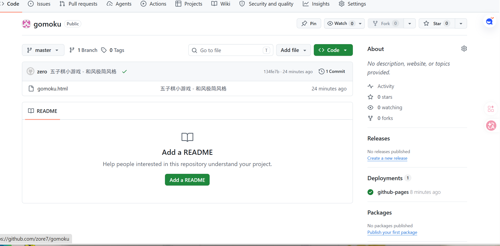

<p align="center">
  <br>
  <br>
  <h1>五 子 棋 · Gomoku</h1>
  <p>
    <a href="https://github.com/zore7/gomoku/blob/master/LICENSE"></a>
    <a href="https://zore7.github.io/gomoku/"></a>
    <a href="https://github.com/zore7/gomoku"></a>
  </p>
  <p>纯单文件 · 零依赖 · 即开即玩</p>
</p>

---

## 预览



在线试玩 → [**zore7.github.io/gomoku**](https://zore7.github.io/gomoku/)

---

## 特性

- **双人对战** — 同一设备黑白轮流落子
- **AI 对手** — 三档难度（简单 / 中等 / 困难），基于窗口滑动评分的攻防策略
- **和风极简设计** — 暖木纹棋盘、瓷质光泽棋子、暗色沉浸背景
- **Canvas 渲染** — 棋盘纹理、星位标记、棋子光影、落子动画
- **落子预览** — hover 时半透明棋子提示
- **悔棋** — 支持 Ctrl+Z，AI 模式自动撤回两步
- **音效** — Web Audio API 实现的落子音与胜利三连音
- **响应式** — 桌面和移动端自适应布局
- **键盘快捷键** — `R` 重新开始、`Ctrl+Z` 悔棋

---

## 快速开始

```bash
git clone https://github.com/zore7/gomoku.git
cd gomoku
open index.html       # 或者直接双击 index.html
```

没有任何编译步骤，不依赖任何框架或库。

---

## 玩法

1. 点击棋盘交叉点落子，黑方先行
2. 横、竖、正斜、反斜任意方向率先五连者胜
3. 棋盘下满自动判平
4. 点击「切换 AI 模式」进入人机对战（你执黑先行）
5. AI 模式下可切换三档难度

---

## AI 策略

AI 采用**窗口滑动评分算法**，对每个候选落子位置沿四方向构建 9 格窗口，以 5 格为单位滑动扫描：

| 得分 | 局面 |
|------|------|
| 100000 | 五连 |
| 10000 | 活四 |
| 1000 | 活三 |
| 100 | 活二 |
| 10 | 单子 |

窗口内出现敌方棋子或撞墙则该窗口无效。最终得分 = 己方攻击分 + 防守分 × 0.9，兼顾进攻与封堵。

**难度差异**：
- **简单**：从得分前 8 位中随机选取
- **中等**：从得分前 3 位中随机选取
- **困难**：始终选取最高分位置

---

## 技术栈

| 层 | 技术 |
|----|------|
| 渲染 | HTML5 Canvas |
| 音效 | Web Audio API |
| AI | 滑动窗口评分 |
| 部署 | GitHub Pages |

单文件实现，总计约 770 行。

---

## 快捷键

| 按键 | 操作 |
|------|------|
| `点击棋盘` | 落子 |
| `Ctrl + Z` | 悔棋（AI 模式撤回两步） |
| `R` | 重新开始 |

---

## License

MIT © [zore7](https://github.com/zore7)
